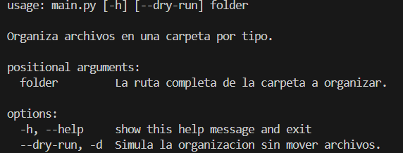

# Organizador de Archivos

Este es un script de Python para organizar automaticamente archivos en una carpeta especifica, moviendolos a subcarpetas segun su tipo.

## Caracteristicas
- Identificacion de tipos de archivos.
- Creacion dinamica de carpetas.
- Movimiento de archivos.
- Manejo de duplicados.
- CLI.
- dry-run.

## Como usar
1. Clonar el repositorio.
2. Crear y activar entorno virtual (python -m venv .venv, .\.venv\Scripts\activate.ps1 ).
3. Instalar dependencias ( pip install -r requirements.txt ).
4. Ejecutar el script ( python main.py "ruta/de/carpeta" [--dry-run] ).
5. 

## Tecnologias
- Python 3.x
- os
- shutil
- argparse
- venv

## Autor
Lifimastar
